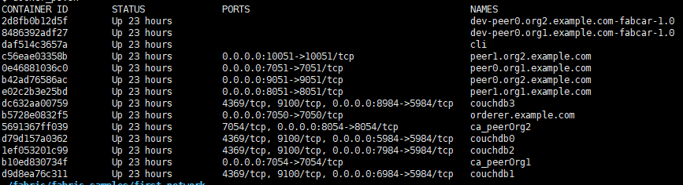

# fabric-sdk-java-scratch

这是一个 SDK 的例子

## 环境搭建

1. Fabric 的版本是1.4.0的
2. 使用 [工程hyperledger/fabric-samples](https://github.com/hyperledger/fabric-samples) 1.4版本中例子
   
    >对应的例子路径是 "fabric-samples/fabcar/"
    
3. 启动脚本 startFabric.sh，如果不出现意外的话，使用 docker ps 查询会有如下容器：
    
    
    
    > 从列表中可以看出我们有 CA 服务器，orderer 服务器， peer 服务器等等

## 证书

为了能够将 DEMO 运行起来，我们需要 3 个证书。

1. ca.org1.example.com.pem

    这个证书我们使用如下的方法获取：
    
        1. docker exec -it ca_peerOrg1 bash
        2. cat /etc/hyperledger/fabric-ca-server-config/ca.org1.example.com-cert.pem
        3. 拷贝内容到 DEMO 工程中的 ca.org1.example.com.pem 文件中
        
2. peer0.org1.example.com.pem (还有一个类似的 peer0.org2.example.com.pem，方法类似)

    这个证书我们使用如下的方法获取:
    
        1. 进入目录 "fabric-samples/first-network"
        2. cat crypto-config/peerOrganizations/org1.example.com/tlsca/tlsca.org1.example.com-cert.pem
        3. 拷贝内容到 DEMO 工程中的 peer0.org1.example.com.pem 文件中
        
3. orderer.example.com.pem

    这个证书我们使用如下的方法获取：

        1. 进入目录 "fabric-samples/first-network"
        2. cat crypto-config/ordererOrganizations/example.com/tlsca/tlsca.example.com-cert.pem
        3. 拷贝内容到 DEMO 工程中的 orderer.example.com.pem 文件中

## 修改 HOSTS 文件

1. 打开操作系统的 hosts 文件
2. 添加如下内容:

    ```txt
    xxx.xxx.xxx.xxx peer0.org1.example.com  orderer.example.com ca.org1.example.com
    ```
    
    > 其中 "xxx.xxx.xxx.xxx" 是你对应的 Fabric 网络服务的地址，我是单机搭建的网络，所以都指向了同一个IP地址
    
## 修改 DEMO 中的 userName

如果你的网络是全新的，那么这个步骤可以省略，如果不是，你可能需要做如下修改，将代码：

```txt
String userName = "user15";
```

中的 "user15" 改成别的名字就可以了

## 启动 DEMO 

如果一切顺利，你就可以启动 DEMO 了，DEMO 中用到的函数，有些我添加了简单的注释，不一定准确，只是参考。